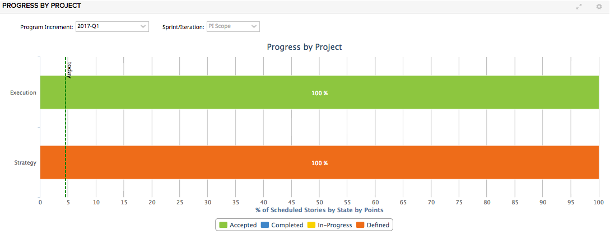

# Progress by Project

This app shows the states of items in a release as percentages.  There is a dotted
vertical line at the percentage that represents the position of today in the program
increment (release).  The selection can be limited by stories that have a feature with
a filter field set to a particular value.

When a release is chosen, a story qualifies for the chart if it is directly associated
with the release name or if its lowest level PI is associated with the release name. 

Percentage is calculated from PlanEstimate.

"Projects" on the y axis are the direct children of the current Rally project.  Data is aggregated from
their descendants. 

The admin settings panel will allow you to pick the text that appears for when no iteration has been selected.  It defaults
to "PI Scope."

This app CAN be put onto a release scoped custom page.  If it is on a non-scoped page, the app's scope selector will show
a dropdown for release.  Otherwise, it uses the release from the page scoping.

The admin settings panel (Consider Velocity) will allow you to decide whether planned state totals are shown 
as a percentage of the average of the team's last six iteration velocities or the states only as a total of 
the planned total. (In the latter case, all the bars will be the full width of the chart; in the former, the 
bars will only be as wide as the total/velocity.)  If the total planned is higher than the velocity, then the
chart bar will be 100%.

## Development Notes

* Need two settings fields to hold the restriction filter field so that the display name of the field can be used on the page, so we put
a hiddent rallytextfield that gets updated with the display name when the field is chosen.

### First Load

If you've just downloaded this from github and you want to do development, 
you're going to need to have these installed:

 * node.js
 * grunt-cli
 * grunt-init
 
Since you're getting this from github, we assume you have the command line
version of git also installed.  If not, go get git.

If you have those three installed, just type this in the root directory here
to get set up to develop:

  npm install

### Structure

  * src/javascript:  All the JS files saved here will be compiled into the 
  target html file
  * src/style: All of the stylesheets saved here will be compiled into the 
  target html file
  * test/fast: Fast jasmine tests go here.  There should also be a helper 
  file that is loaded first for creating mocks and doing other shortcuts
  (fastHelper.js) **Tests should be in a file named <something>-spec.js**
  * test/slow: Slow jasmine tests go here.  There should also be a helper
  file that is loaded first for creating mocks and doing other shortcuts 
  (slowHelper.js) **Tests should be in a file named <something>-spec.js**
  * templates: This is where templates that are used to create the production
  and debug html files live.  The advantage of using these templates is that
  you can configure the behavior of the html around the JS.
  * config.json: This file contains the configuration settings necessary to
  create the debug and production html files.  Server is only used for debug,
  name, className and sdk are used for both.
  * package.json: This file lists the dependencies for grunt
  * auth.json: This file should NOT be checked in.  Create this to run the
  slow test specs.  It should look like:
    {
        "username":"you@company.com",
        "password":"secret"
    }
  
### Usage of the grunt file
####Tasks
    
##### grunt debug

Use grunt debug to create the debug html file.  You only need to run this when you have added new files to
the src directories.

##### grunt pretty / grunt ugly

Use grunt build to create the production html file.  We still have to copy the html file to a panel to test.

##### grunt test-fast

Use grunt test-fast to run the Jasmine tests in the fast directory.  Typically, the tests in the fast 
directory are more pure unit tests and do not need to connect to Rally.

##### grunt test-slow

Use grunt test-slow to run the Jasmine tests in the slow directory.  Typically, the tests in the slow
directory are more like integration tests in that they require connecting to Rally and interacting with
data.
